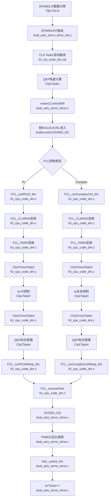
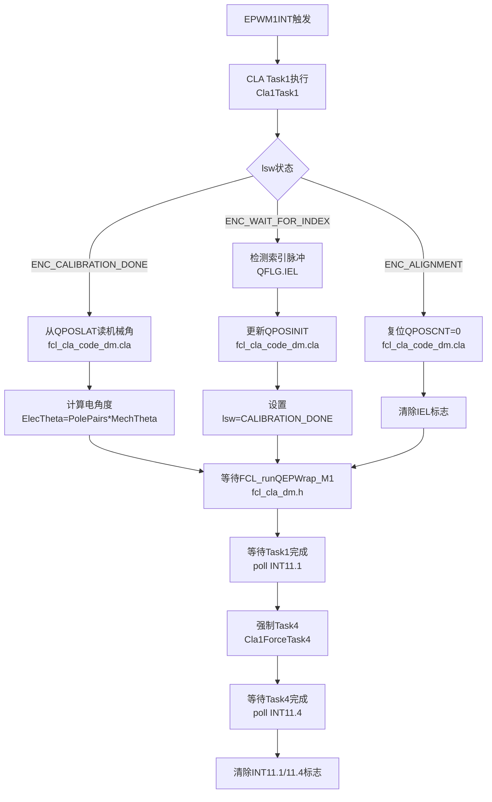

# 双轴伺服驱动项目文档

**最后更新**: 2026-03-12

---

## 一、更改记录

### 2026-03-12：双电机场景澄清 + TZ误触发根因修复 + 日志纠偏

#### 1) 硬件场景确认

- 当前仅电机1接入驱动板。
- 电机2未接驱动板，调试时不应作为联锁停机条件。

#### 2) TZ误触发根因

- HAL 中过热/外部故障相关 GPIO（OT_M1/OT_M2）未实际接入外部有效信号。
- 这些外部口通过 INPUTXBAR 参与 Trip 合成时，在当前硬件条件下可能出现悬空误触发，导致 TZ 保护链被误拉起。

#### 3) 本次有效更改（保留过流保护）

- Trip 合成源改为仅使用 CMPSS 路径：
	- M1: TRIP4 仅保留 CMPSS mux
	- M2: TRIP5 仅保留 CMPSS mux
- 不再启用 INPUTXBAR1/2 作为 Trip 触发源。
- 结果：初始化阶段无需再依赖“先禁用保护”也可正常起转，同时 CMPSS 过流保护链保持可用。

#### 4) 日志清理说明

- 已删除此前与当前实现不一致的错误调试记录（尤其是“长期禁用 DCAEVT1/CBC6 作为最终方案”等结论）。
- 本文档后续以本节为准。

---

## 二、与 Origin 版本差异总结

origin 路径：`origin/origin_dual_axis_servo_drive.c`

### 2.1 dual_axis_servo_drive.c 功能差异

| 类别 | Origin | 当前版本 |
|------|--------|----------|
| **全局变量** | `enableFlag=false`, `VdTesting=0`, `VqTesting=0.10`, `speedRef=0.1` | `enableFlag=true`(自动启动), `VdTesting=0.01`, `VqTesting=0.05`, `speedRef=0.02` |
| **LEVEL1~4 init** | 各级别分散的独立 init 块；LEVEL3 无 init 代码 | 合并为统一 init 块，speedRef 按级别区分 |
| **runMotor 预设** | LEVEL4 init 预设 `motorVars[x].runMotor=MOTOR_RUN`（有栅极时序 bug） | 所有级别不预设，由 `runMotorControl` 检测跳变统一启用 |
| **TZ/Trip 保护策略** | 保留外部 INPUTXBAR + CMPSS 共同参与 Trip | Trip4/Trip5 仅保留 CMPSS，移除未接外部 INPUTXBAR 源 |
| **电压监控** | 仅 LEVEL4+ 启用 | 所有级别启用 |
| **TZ OST 检测** | LEVEL1 写 `TZCTL` + 清标志；LEVEL2/3 仅清标志不检测 | 所有级别走 OST 检测并触发停机 |
| **clearTripFlagDMC** | 无条件 `=1`（周期性清除） | 当前版本同样在初始化置 `=1`（与 origin 一致） |
| **_FLASH 模式** | 无条件 `ctrlState=CTRL_STOP` | LEVEL1~4 跳过，不覆盖自动运行 |
| **LEVEL2 电流限** | 9.0A | 当前版本为 9.0A（与 origin 一致） |
| **电机2** | 正常参与故障联锁和控制 | 完全隔离（runSyncControl/A2 task/offset cal） |
| **Motor2 状态变量** | 无 | 新增 `motor2_runMotor` / `motor2_ctrlState` 用于 Watch 窗口观察 |
| **buildLevel3_M2 bug** | `getVdc(&motorVars[0])`（错误，应为 motorVars[1]） | 已修复为 `getVdc(&motorVars[1])` |
| **中文注释** | 无 | 全文添加详细中文注释 |

### 2.2 dual_axis_servo_drive_hal.c 功能差异

| 类别 | Origin | 当前版本 |
|------|--------|----------|
| **QEP1 索引引脚** | GPIO99 | GPIO23（匹配实际硬件） |
| **GPIO156** | 配置错误（使用了 GPIO139 配置） | 已修正 |
| **TZ 动作** | LEVEL4 在 `#else` 分支，TZ 动作为 LOW | LEVEL4 加入 DISABLE 分支，LEVEL5+ 才用 LOW |
| **中文注释** | 无 | 全文添加 |

### 2.3 dual_axis_servo_drive_user.c 功能差异

| 类别 | Origin | 当前版本 |
|------|--------|----------|
| **EPWM 中断等待** | 无超时保护，可能死循环 | 添加超时机制 |
| **中文注释** | 无 | 全文添加 |

### 2.4 待完成项

- [ ] `M1_MAXIMUM_SCALE_VOLATGE` 从 66.3 改为 ~64.4（补偿 3% 增益 + 1.1V 偏移）
- [ ] 电机2重新接入驱动板后，恢复双轴联锁和 motor2 控制
- [ ] LEVEL5+ 的 CMPSS 硬件过流保护正式启用

### 2.5 2026-03-12 再次对比 Origin 复核结论

- 本次复核范围：`dual_axis_servo_drive.c`、`dual_axis_servo_drive_hal.c`、`dual_axis_servo_drive_user.c`、`fcl_cpu_code_dm.c` 与 origin 对应文件逐一比对。
- 功能性差异仍集中在主流程与保护链：
	- `dual_axis_servo_drive.c`：运行参数、电机2隔离策略、状态机/故障处理逻辑有实质改动。
	- `dual_axis_servo_drive_hal.c`：QEP1I 引脚、TZ 动作分级策略、Trip 源配置（CMPSS-only）有实质改动。
- `dual_axis_servo_drive_user.c` 与 `fcl_cpu_code_dm.c`：以注释、可读性和调试观测增强为主；核心 FCL 算法主链未发现与 origin 相冲突的结构性改写。
- 结论：当前与 origin 的关键偏离点已可追溯到“单板场景 + TZ误触发规避 + 电机2隔离”三条主线。

---

## 三、Sources文件夹文件说明

### 核心文件

| 文件名 | 功能描述 |
|--------|----------|
| **dual_axis_servo_drive.c** | 主程序文件，包含电机控制主循环、状态机、ISR（中断服务程序） |
| **dual_axis_servo_drive_hal.c** | 硬件抽象层实现，配置GPIO、ADC、PWM、QEP、CMPSS、DAC、CLA等外设 |
| **dual_axis_servo_drive_user.c** | 用户参数初始化，包括电机参数、PI控制器、FCL参数、编码器参数等 |

### CLA任务文件

| 文件名 | 功能描述 |
|--------|----------|
| **dual_axis_servo_drive_cla_tasks.cla** | CLA（控制律加速器）任务定义，用于执行高速电流环控制 |
| **fcl_cla_code_dm.cla** | FCL（快速电流环）CLA实现代码，包含SVPWM、电流采样等 |

### 算法文件

| 文件名 | 功能描述 |
|--------|----------|
| **fcl_cpu_code_dm.c** | FCL CPU端代码，处理速度环、位置环等低速控制 |
| **dlog_4ch_f.c** | 4通道数据记录器，用于调试和波形采集 |

### 通信文件

| 文件名 | 功能描述 |
|--------|----------|
| **sfra_gui.c** | SFRA（软件频率响应分析）GUI接口 |
| **sfra_gui_scicomms_driverlib.c** | SCI通信驱动，用于与上位机GUI通信 |

---

## 四、FOC（磁场定向控制）架构

### 4.1 系统架构

- 双电机独立运行，共享同一套 CPU 调度与监控框架。
- 电流环由 CLA 执行，负责高速采样、变换、电流调节与 PWM 更新。
- 速度环、位置环、通信、保护与调试由 CPU 执行。
- 整体结构是"CLA 做快环，CPU 做慢环与系统管理"。

### 4.2 FCL（快速电流环）逻辑

- 速度环输出 Iq_ref，Id_ref 一般为 0 或弱磁参考。
- CLA 完成采样、Clark/Park 变换、电流 PI、反变换与 SVPWM 更新。
- PWM 驱动逆变器，逆变器驱动电机，电流反馈回到 ADC 构成闭环。
- 该链路是整个系统实时性要求最高的部分。

### 4.3 控制层级

| 层级 | 执行单元 | 控制周期 | 功能 |
|------|----------|----------|------|
| **电流环 (FCL)** | CLA | 50μs (20KHz) | Id/Iq电流控制、SVPWM、ADC采样 |
| **速度环** | CPU | 100μs (10KHz) | 速度PID控制、斜坡控制 |
| **位置环** | CPU | 1ms (1KHz) | 位置PI控制、轨迹规划 |
| **通信/监控** | CPU | 10-100ms | SCI通信、数据记录、故障诊断 |

### 4.4 关键算法模块

#### 4.4.1 电流采样与处理
- **ADC配置**：4个ADC模块（A/B/C/D），12位分辨率
- **采样触发**：EPWM SOCA事件触发
- **PPB（峰值保持）**：用于消除偏移量计算
- **采样相**：双电阻或三电阻采样（Iu, Iv, Iw）

#### 4.4.2 坐标变换
- **Clark变换**：三相静止坐标系 → 两相静止坐标系 (α, β)
- **Park变换**：两相静止坐标系 → 两相旋转坐标系 (d, q)
- **反Park变换**：旋转坐标系 → 静止坐标系

#### 4.4.3 PI控制器
- **电流环PI**：Kp = LS × BW, Ki = RS × BW
- **速度环PID**：Kp, Ki, Kd可调
- **位置环PI**：Kp, Ki可调

#### 4.4.4 SVPWM（空间矢量脉宽调制）
- 七段式SVPWM
- 调制指数限制：考虑死区时间和FCL计算时间
- 载波频率：10KHz

### 4.5 硬件资源分配

#### 电机1资源
| 资源类型 | 具体分配 |
|----------|----------|
| **PWM** | EPWM1 (U相), EPWM2 (V相), EPWM3 (W相) |
| **ADC** | ADCC (Iu), ADCB (Iv), ADCA (Iw), ADCD (Vdc) |
| **QEP** | EQEP1 (编码器) |
| **CMPSS** | CMPSS6 (U), CMPSS3 (V), CMPSS1 (W) |
| **GPIO** | GPIO0-5 (PWM), GPIO20-21 (QEP), GPIO19/24 (故障) |
| **中断** | EPWM1_INT (电流环) |

#### 电机2资源
| 资源类型 | 具体分配 |
|----------|----------|
| **PWM** | EPWM4 (U相), EPWM5 (V相), EPWM6 (W相) |
| **ADC** | ADCC (Iu), ADCB (Iv), ADCA (Iw), ADCD (Vdc) |
| **QEP** | EQEP2 (编码器) |
| **CMPSS** | CMPSS5 (U/V), CMPSS2 (W) |
| **GPIO** | GPIO6-11 (PWM), GPIO14/26/27 (控制) |
| **中断** | EPWM4_INT (电流环) |

### 4.6 保护机制

| 保护类型 | 实现方式 | 动作 |
|----------|----------|------|
| **过流保护** | CMPSS硬件比较器 | 立即关闭PWM |
| **过压保护** | ADC软件监测 | 软件限幅 |
| **欠压保护** | ADC软件监测 | 软件限幅 |
| **过热保护** | GPIO输入监测 | 软件停机 |
| **编码器故障** | QEP状态监测 | 软件停机 |

---

## 五、文件依赖关系

- dual_axis_servo_drive.c：主流程、状态机、ISR 调度入口。
- dual_axis_servo_drive_hal.c：外设初始化与硬件抽象层。
- dual_axis_servo_drive_user.c：电机参数、控制器参数与运行参数初始化。
- fcl_cpu_code_dm.c：CPU 侧 FCL 控制与包装逻辑。
- dual_axis_servo_drive_cla_tasks.cla、fcl_cla_code_dm.cla：CLA 任务入口与高速电流环实现。
- dlog_4ch_f.c、sfra_gui.c、sfra_gui_scicomms_driverlib.c：调试、频响分析与通信支持。

---

## 六、调试与监控

### 6.1 数据记录通道（DLOG）
- 通道1：Id电流
- 通道2：Iq电流
- 通道3：速度反馈
- 通道4：位置反馈

### 6.2 SFRA（软件频率响应分析）
- 用于测量系统开环/闭环频率响应
- 支持速度环、电流环调试
- 通过SCI与GUI通信

### 6.3 DAC输出（可选）
- DAC-A：旋转变压器载波激励
- DAC-B/C：通用调试输出

---

## 七、系统 I/O 与 TZ 映射总表（防遗漏）

### 7.1 关键输入（与控制/保护直接相关）

| 类别 | 资源 | 方向 | 用途 | 所在文件/函数 |
|------|------|------|------|---------------|
| 编码器 M1 | GPIO20/21/23 -> EQEP1A/B/I | 输入 | 电机1位置速度反馈 | dual_axis_servo_drive_hal.c / `HAL_setupGPIOs()` |
| 编码器 M2 | GPIO54/55/57 -> EQEP2A/B/I | 输入 | 电机2位置速度反馈 | dual_axis_servo_drive_hal.c / `HAL_setupGPIOs()` |
| 过热输入 | GPIO24(OT_M1), GPIO14(OT_M2) | 输入 | 外部过热信号（当前硬件未接） | dual_axis_servo_drive_hal.c / `HAL_setupGPIOs()` |
| 驱动故障输入 | GPIO19(nFault_M1), GPIO139(nFault_M2) | 输入 | 驱动器故障状态采样 | dual_axis_servo_drive_hal.c / `HAL_setupGPIOs()` |
| 相电流采样 | CMPSS1/3/6(M1), CMPSS5/2(M2) | 模拟比较链 | 过流比较与 Trip 触发源 | dual_axis_servo_drive_hal.c / `HAL_setupMotorFaultProtection()` |
| 母线电压/电流ADC | ADCA/B/C/D + PPB | 模拟输入 | 电流环/限幅/监控 | dual_axis_servo_drive_user.c / `initMotorParameters()` |

### 7.2 关键输出（与执行/使能直接相关）

| 类别 | 资源 | 方向 | 用途 | 所在文件/函数 |
|------|------|------|------|---------------|
| PWM M1 | GPIO0~5 -> EPWM1~3 A/B | 输出 | 电机1三相上下桥驱动 | dual_axis_servo_drive_hal.c / `HAL_setupGPIOs()` |
| PWM M2 | GPIO6~11 -> EPWM4~6 A/B | 输出 | 电机2三相上下桥驱动 | dual_axis_servo_drive_hal.c / `HAL_setupGPIOs()` |
| 栅极使能 | GPIO124(EN_GATE_M1), GPIO26(EN_GATE_M2) | 输出 | 驱动器使能/关闭 | dual_axis_servo_drive_hal.c / `HAL_setupGPIOs()` |
| 调试指示 | GPIO31/34 LED, GPIO157~160 EPWM7/8 | 输出 | 心跳灯与DAC调试 | dual_axis_servo_drive_hal.c / `HAL_setupGPIOs()` |

### 7.3 TZ/Trip 映射（当前生效路径）

| 电机 | Trip 通道 | 生效源（已启用 Mux） | ePWM 事件路径 | 说明 |
|------|-----------|----------------------|---------------|------|
| M1 | TRIP4 | CMPSS1/3/6 | DCAH -> DCAEVT1 + CBC6 | 已移除外部 INPUTXBAR 触发源 |
| M2 | TRIP5 | CMPSS5/2 | DCAH -> DCAEVT1 + CBC6 | 已移除外部 INPUTXBAR 触发源 |

### 7.4 防遗漏检查清单（每次改保护都要过一遍）

1. 检查 `XBAR_enableEPWMMux()` 实际使能了哪些 Mux，是否误把未接外部源并入 Trip。
2. 检查 OT/nFault 相关 GPIO 是否真实接线；未接时必须有上拉/下拉策略，或不并入 Trip 生效链。
3. 检查 `EPWM_enableTripZoneSignals()` 与 `EPWM_setTripZoneAction()` 组合是否符合当前 BUILDLEVEL 目标。
4. 每次改完保护链都清标志并复测：`HAL_clearTZFlag()` + 启停测试 + 过流注入测试。

---

## 八、初始化流程图（含函数与文件）

```mermaid
flowchart TD
	A[main<br/>dual_axis_servo_drive.c] --> B[Device_init<br/>dual_axis_servo_drive.c]
	B --> C[HAL_init + HAL_MTR_init(M1/M2)<br/>dual_axis_servo_drive_hal.c]
	C --> D[HAL_setParams<br/>dual_axis_servo_drive_hal.c]
	D --> D1[HAL_setupCLA<br/>dual_axis_servo_drive_hal.c]
	D1 --> D2[CLA_mapTaskVector<br/>dual_axis_servo_drive_hal.c]
	D2 --> D3[CLA_setTriggerSource<br/>dual_axis_servo_drive_hal.c]
	D3 --> E[HAL_setMotorParams(M1/M2)<br/>dual_axis_servo_drive_hal.c]
	E --> E1[HAL_setupMotorPWMs<br/>dual_axis_servo_drive_hal.c]
	E1 --> E2[HAL_setupCMPSS<br/>dual_axis_servo_drive_hal.c]
	E2 --> E3[HAL_setupQEP<br/>dual_axis_servo_drive_hal.c]
	E3 --> F[initMotorParameters(M1/M2)<br/>dual_axis_servo_drive_user.c]
	F --> F1[FCL_initPWM + FCL_initADC_3I<br/>fcl_cpu_code_dm.c]
	F1 --> F2[FCL_initQEP<br/>fcl_cpu_code_dm.c]
	F2 --> G[initControlVars + resetControlVars<br/>dual_axis_servo_drive_user.c]
	G --> G1[PI控制器参数初始化<br/>dual_axis_servo_drive_user.c]
	G1 --> H[HAL_setupMotorFaultProtection(M1/M2)<br/>dual_axis_servo_drive_hal.c]
	H --> H1[CMPSS过流保护配置<br/>dual_axis_servo_drive_hal.c]
	H1 --> I[HAL_clearTZFlag(M1/M2)<br/>dual_axis_servo_drive_hal.c]
	I --> J[HAL_setupInterrupts<br/>dual_axis_servo_drive_hal.c]
	J --> J1[EPWM中断配置<br/>dual_axis_servo_drive_hal.c]
	J1 --> K[runOffsetsCalculation(M1)<br/>dual_axis_servo_drive_user.c]
	K --> L[HAL_enableInterrupts<br/>dual_axis_servo_drive_hal.c]
	L --> M[设置clearTripFlagDMC=1<br/>dual_axis_servo_drive.c]
	M --> N[GPIO_writePin禁用栅极<br/>dual_axis_servo_drive.c]
	N --> O[EINT/ERTM<br/>dual_axis_servo_drive.c]
	O --> P[LEVEL1/2/3/4初始化<br/>dual_axis_servo_drive.c]
	P --> Q[进入for(;;)循环<br/>dual_axis_servo_drive.c]
	Q --> R[Alpha_State_Ptr调度 A0/B0/C0<br/>dual_axis_servo_drive.c]
```

---

## 九、控制流程图（FCL 工作流，含函数与文件）

### 9.1 快环中断流程（50μs周期）



### 9.2 QEP角度计算流程（CLA后台自动执行）



### 9.3 慢环状态机流程（主循环）

```mermaid
flowchart TD
	A[主循环for(;;)] --> B[Alpha_State_Ptr调度<br/>dual_axis_servo_drive.c]
	B --> C[A0: 50μs周期]
	B --> D[B0: 100μs周期]
	B --> E[C0: 150μs周期]
	
	C --> C1[A1: 电机1电流环<br/>50μs周期]
	C --> C2[A2: 电机2电流环<br/>50μs周期]
	C --> C3[A3: 系统状态管理]
	
	D --> D1[B1: 电机1速度环<br/>100μs周期]
	D --> D2[B2: 电机2速度环<br/>100μs周期]
	D --> D3[B3: 故障检测处理]
	
	E --> E1[C1: 电机1位置环<br/>150μs周期]
	E --> E2[C2: 电机2位置环<br/>150μs周期]
	E --> E3[C3: 通信与监控]
	
	C1 --> F[与ISR快环并行]
	C2 --> F
	D1 --> F
	D2 --> F
	E1 --> F
	E2 --> F
```

### 9.4 CLA任务分配表

| 任务 | 电机 | 触发源 | 功能 | 执行周期 |
|------|------|--------|------|----------|
| **Task1** | M1 | EPWM1INT自动触发 | QEP角度计算 | 50μs |
| **Task2** | M1 | CPU强制触发(Cla1ForceTask2) | Iq PI控制 | 50μs |
| **Task3** | M1 | CPU强制触发(Cla1ForceTask3) | Iq复杂控制 | 50μs |
| **Task4** | M1 | CPU强制触发(Cla1ForceTask4) | QEP标志管理 | 50μs |
| **Task5** | M2 | EPWM4INT自动触发 | QEP角度计算 | 50μs |
| **Task6** | M2 | CPU强制触发(Cla1ForceTask6) | Iq PI控制 | 50μs |
| **Task7** | M2 | CPU强制触发(Cla1ForceTask7) | Iq复杂控制 | 50μs |
| **Task8** | M2 | CPU强制触发(Cla1ForceTask8) | QEP标志管理 | 50μs |

> 说明：电机2路径与电机1同构，对应函数为 `motor2ControlISR`、`buildLevel*_M2`、`FCL_run*_*_M2`、`Cla1ForceTask5/6/7/8`。

---

*文档创建日期：2026-03-03*
*项目：双轴伺服驱动 (FCL-QEP-F2837x)*
